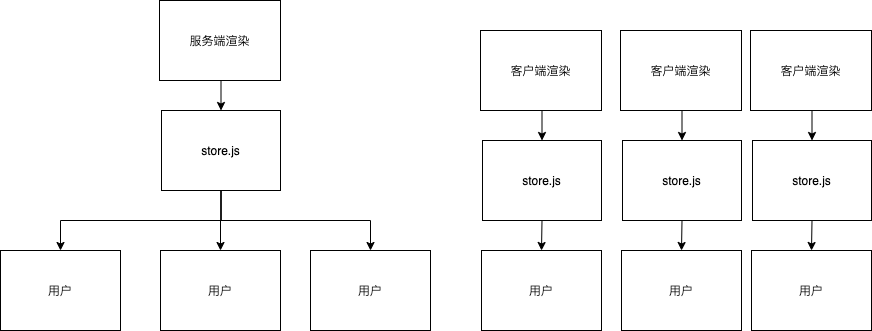

## 5-8 nextjs 集成 redux

-   问题: 服务端渲染会导致共用一个 store



-   将 reduxStore 注入 withReduxApp 组件的 getInitialProps(客户端、服务端渲染都会被执行) 方法里

-   解决：改造一下 store/store.js，不再直接暴露出 store 对象，而是暴露一个创建 store 的方法，并且允许传入初始状态来进行初始化。

```js
// 修改store.js
export default function initializeStore(state) {
    const store = createStore(
        reducer,
        Object.assign({}, initialState, state),
        composeWithDevTools(applyMiddleware(ReduxThunk))
    );
    return store;
}
```

-   在 lib 目录下新建 with-redux-app.js，我们决定用这个 hoc 来包裹\_app.js 里导出的组件，每次加载 app 都要通过我们这个 hoc

```jsx
import React from "react";
import initializeStore from "../store/store";

const isServer = typeof window === "undefined";
const __NEXT_REDUX_STORE__ = "__NEXT_REDUX_STORE__";

function getOrCreateStore(initialState) {
    if (isServer) {
        // 服务端每次执行都重新创建一个store
        return initializeStore(initialState);
    }
    // 在客户端执行这个方法的时候 优先返回window上已有的store
    // 而不能每次执行都重新创建一个store 否则状态就无限重置了
    if (!window[__NEXT_REDUX_STORE__]) {
        window[__NEXT_REDUX_STORE__] = initializeStore(initialState);
    }
    return window[__NEXT_REDUX_STORE__];
}

export default (Comp) => {
    class withReduxApp extends React.Component {
        constructor(props) {
            super(props);
            // getInitialProps创建了store 这里为什么又重新创建一次？
            // 因为服务端执行了getInitialProps之后 返回给客户端的是序列化后的字符串
            // redux里有很多方法 不适合序列化存储
            // 所以选择在getInitialProps返回initialReduxState初始的状态
            // 再在这里通过initialReduxState去创建一个完整的store
            this.reduxStore = getOrCreateStore(props.initialReduxState);
        }

        render() {
            const { Component, pageProps, ...rest } = this.props;
            return (
                <Comp
                    {...rest}
                    Component={Component}
                    pageProps={pageProps}
                    reduxStore={this.reduxStore}
                />
            );
        }
    }

    // 这个其实是_app.js的getInitialProps
    // 在服务端渲染和客户端路由跳转时会被执行
    // 所以非常适合做redux-store的初始化
    withReduxApp.getInitialProps = async (ctx) => {
        const reduxStore = getOrCreateStore();
        ctx.reduxStore = reduxStore;

        let appProps = {};
        if (typeof Comp.getInitialProps === "function") {
            appProps = await Comp.getInitialProps(ctx);
        }

        return {
            ...appProps,
            initialReduxState: reduxStore.getState(),
        };
    };

    return withReduxApp;
};
```

-   在\_app.js 中引入 hoc

```jsx
import App, { Container } from "next/app";
import "antd/dist/antd.css";
import React from "react";
import { Provider } from "react-redux";
import Layout from "../components/Layout";
import initializeStore from "../store/store";
import withRedux from "../lib/with-redux-app";
class MyApp extends App {
    // App组件的getInitialProps比较特殊
    // 能拿到一些额外的参数
    // Component: 被包裹的组件
    static async getInitialProps(ctx) {
        const { Component } = ctx;
        let pageProps = {};

        // 拿到Component上定义的getInitialProps
        if (Component.getInitialProps) {
            // 执行拿到返回结果`
            pageProps = await Component.getInitialProps(ctx);
        }

        // 返回给组件
        return {
            pageProps,
        };
    }

    render() {
        const { Component, pageProps, reduxStore } = this.props;
        return (
            <Container>
                <Layout>
                    <Provider store={reduxStore}>
                        {/* 把pageProps解构后传递给组件 */}
                        <Component {...pageProps} />
                    </Provider>
                </Layout>
            </Container>
        );
    }
}

export default withRedux(MyApp);
```

这样，我们就实现了在 next 中集成 redux。
