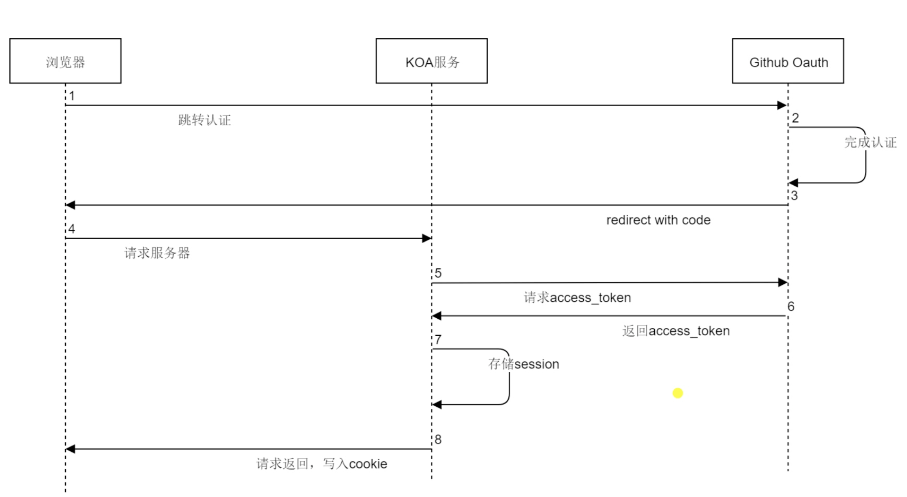

## 认证和授权介绍

概述：OAuth 是一种行业标准的授权方式，通过客户端、服务端、授权服务器三个角色进行权限验证。

请求 token

-   client_id, client_secret: 表明这个网站有使用 github 登录的权限

-   code: 表明用户授权了，一次性

-   redirect_uri: 跳转地址

流程：

访问：

1. 用户授权

    https://github.com/login/oAuth/authorize?client_id=xxx&scope=xxx&redirect_uri=xxx
    （进行用户授权,成功后跳回并携带 code）

2. 拿到 token

    https://github.com/login/oAuth/access_token
    （携带 body：client_id, client_secret, code）

3. 拿到用户信息

    https://api.github.com/user
    （携带 header 头：access_token）
